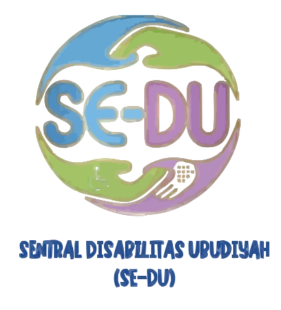

# SE-DU (Sentral Disabilitas Ubudiyah)

<div align="center">
  

### Unit Layanan Disabilitas Universitas Ubudiyah Indonesia

[](https://laravel.com)
[](https://reactjs.org)
[](https://inertiajs.com)
[](https://tailwindcss.com)

</div>

---

## 📖 Tentang SE-DU

**SE-DU (Sentral Disabilitas Ubudiyah)** adalah platform digital Unit Layanan Disabilitas di Universitas Ubudiyah Indonesia yang dirancang untuk mewujudkan kampus inklusif dan aksesibel bagi seluruh mahasiswa penyandang disabilitas.

### 🎯 Visi

> "Menjadi pusat layanan disabilitas yang inklusif, aksesibel, dan berkeadilan bagi seluruh mahasiswa penyandang disabilitas."

### 🚀 Misi

1. Menyediakan layanan pendampingan akademik dan non-akademik bagi mahasiswa penyandang disabilitas
2. Mengembangkan sarana dan prasarana kampus yang aksesibel sesuai kebutuhan mahasiswa disabilitas
3. Meningkatkan kesadaran dan kapasitas sivitas akademika dalam mewujudkan kampus inklusif
4. Membangun jejaring dan kerja sama dengan lembaga terkait untuk penguatan layanan disabilitas
5. Memberikan ruang pengembangan potensi, minat, dan bakat mahasiswa disabilitas

### 🎓 Tujuan

Platform SE-DU dikembangkan untuk:

1. Memberikan dukungan akademik dan non-akademik yang setara bagi mahasiswa penyandang disabilitas
2. Menciptakan lingkungan kampus yang ramah, inklusif, dan bebas dari diskriminasi
3. Menyediakan akses sarana, prasarana, serta layanan teknologi yang mendukung kebutuhan mahasiswa disabilitas
4. Meningkatkan pemahaman, kepedulian, dan sikap inklusif sivitas akademika
5. Memastikan terpenuhinya hak pendidikan sesuai peraturan perundang-undangan
6. Menjadi pusat rujukan dan koordinasi dalam pengembangan layanan disabilitas
7. Mengembangkan potensi, minat, dan bakat mahasiswa penyandang disabilitas

### 💎 Nilai-Nilai Utama

- **Inklusifitas** – Menerima dan menghargai setiap perbedaan
- **Aksesibilitas** – Memastikan setiap mahasiswa dapat mengakses fasilitas dan layanan kampus
- **Empati** – Memahami kebutuhan mahasiswa disabilitas secara manusiawi dan berkeadilan
- **Kolaborasi** – Bekerja sama dengan berbagai pihak untuk memperkuat layanan
- **Kemandirian** – Mendorong mahasiswa disabilitas untuk berkembang dan berdaya

---

## 🌟 Layanan SE-DU

Platform ini menyediakan akses digital untuk berbagai layanan:

- ✅ **Pendampingan Akademik dan Psikososial**
- ✅ **Bimbingan Karier dan Pengembangan Diri**
- ✅ **Penyesuaian Sarana dan Prasarana Kampus** (Aksesibilitas fisik dan digital)
- ✅ **Penyediaan Media Pembelajaran Adaptif**
- ✅ **Konseling Inklusif dan Advokasi Hak Mahasiswa Disabilitas**
- ✅ **Pelatihan dan Sosialisasi Kesadaran Disabilitas** bagi sivitas akademika

---

## 🛠️ Tech Stack

Platform SE-DU dibangun menggunakan teknologi modern untuk memastikan performa, aksesibilitas, dan pengalaman pengguna yang optimal:

### Backend

- **[Laravel 12](https://laravel.com)** - PHP Framework yang elegan dan powerful
- **[Laravel Fortify](https://laravel.com/docs/fortify)** - Authentication backend
- **[Laravel Pint](https://laravel.com/docs/pint)** - Code styling
- **[Laravel Herd](https://herd.laravel.com)** - Local development environment

### Frontend

- **[React 19](https://react.dev)** - Modern UI library
- **[Inertia.js v2](https://inertiajs.com)** - Modern monolith approach
- **[TypeScript](https://www.typescriptlang.org/)** - Type-safe JavaScript
- **[Tailwind CSS 4](https://tailwindcss.com)** - Utility-first CSS framework
- **[shadcn/ui](https://ui.shadcn.com/)** - Re-usable components

### Testing

- **[Pest 4](https://pestphp.com)** - Elegant PHP testing framework
- **[PHPUnit 12](https://phpunit.de/)** - PHP testing framework

### Build Tools

- **[Vite](https://vitejs.dev)** - Next generation frontend tooling
- **[Laravel Wayfinder](https://github.com/laravel/wayfinder)** - Type-safe routing

---

## 📋 Prerequisites

Sebelum memulai, pastikan sistem Anda memiliki:

- **PHP** >= 8.4
- **Composer** >= 2.0
- **Node.js** >= 18.x
- **npm** >= 9.x
- **SQLite** (atau database lain yang didukung Laravel)

---

## 🚀 Installation

### 1. Clone Repository

```powershell
git clone <repository-url> se-du
cd se-du
```

### 2. Install Dependencies

```powershell
# Install PHP dependencies
composer install

# Install Node.js dependencies
npm install
```

### 3. Environment Setup

```powershell
# Copy environment file
cp .env.example .env

# Generate application key
php artisan key:generate
```

### 4. Database Setup

```powershell
# Create database (jika menggunakan SQLite)
New-Item -ItemType File -Path database\database.sqlite -Force

# Run migrations
php artisan migrate

# (Optional) Seed database dengan data dummy
php artisan db:seed
```

### 5. Build Frontend Assets

```powershell
# Development build
npm run dev

# Production build
npm run build
```

### 6. Start Development Server

```powershell
# Option 1: Using Laravel Herd (Recommended)
# Website akan otomatis tersedia di https://se-du.test

# Option 2: Using Artisan serve
php artisan serve

# Option 3: Run all (backend + frontend)
composer run dev
```

---

## 🎨 Development

### Running Tests

```powershell
# Run all tests
php artisan test

# Run specific test file
php artisan test tests/Feature/DashboardTest.php

# Run with filter
php artisan test --filter=testName

# Run with coverage
php artisan test --coverage
```

### Code Formatting

```powershell
# Format PHP code with Pint
vendor/bin/pint

# Only check dirty files
vendor/bin/pint --dirty
```

### Frontend Development

```powershell
# Run Vite dev server (hot reload)
npm run dev

# Build for production
npm run build

# Type checking
npm run type-check

# Lint code
npm run lint
```

---

## 📂 Project Structure

```
se-du/
├── app/                    # Application core
│   ├── Http/
│   │   ├── Controllers/    # Request controllers
│   │   ├── Middleware/     # HTTP middleware
│   │   └── Requests/       # Form request validation
│   ├── Models/             # Eloquent models
│   └── Providers/          # Service providers
├── bootstrap/              # Framework bootstrap
├── config/                 # Configuration files
├── database/               # Database migrations, factories, seeders
├── public/                 # Public assets
├── resources/              # Frontend resources
│   ├── css/
│   ├── js/
│   │   ├── actions/        # Server actions
│   │   ├── components/     # React components
│   │   ├── layouts/        # Layout components
│   │   ├── pages/          # Inertia pages
│   │   └── routes/         # Route definitions
│   └── views/              # Blade templates
├── routes/                 # Application routes
│   ├── web.php            # Web routes
│   ├── auth.php           # Authentication routes
│   └── settings.php       # Settings routes
├── storage/               # Storage files
├── tests/                 # Test files
│   ├── Feature/           # Feature tests
│   └── Unit/              # Unit tests
└── vendor/                # Composer dependencies
```

---

## 🗄️ Database Schema

Platform SE-DU menggunakan skema database yang terstruktur untuk mengelola berbagai aspek layanan:

### Tables Overview

#### 1. **users** - Manajemen Admin

Mengelola data administrator dan pengguna sistem.

| Column     | Type   | Description                          |
| ---------- | ------ | ------------------------------------ |
| id         | bigint | Primary key                          |
| name       | string | Nama lengkap user                    |
| email      | string | Email (unique)                       |
| password   | string | Password (hashed)                    |
| role       | string | Role user (admin, super_admin, etc.) |
| timestamps | -      | created_at, updated_at               |

#### 2. **posts** - Berita, Kegiatan, Artikel

Menyimpan konten berita, kegiatan, dan artikel SE-DU.

| Column       | Type      | Description                  |
| ------------ | --------- | ---------------------------- |
| id           | bigint    | Primary key                  |
| user_id      | bigint    | Foreign key ke users         |
| category_id  | bigint    | Foreign key ke categories    |
| title        | string    | Judul post                   |
| slug         | string    | URL-friendly slug (unique)   |
| body         | text      | Konten post                  |
| image        | string    | Path gambar utama (nullable) |
| status       | enum      | draft, published, archived   |
| published_at | timestamp | Tanggal publikasi (nullable) |
| timestamps   | -         | created_at, updated_at       |

#### 3. **categories** - Kategori Konten

Kategori untuk mengelompokkan posts.

| Column     | Type   | Description                |
| ---------- | ------ | -------------------------- |
| id         | bigint | Primary key                |
| name       | string | Nama kategori              |
| slug       | string | URL-friendly slug (unique) |
| timestamps | -      | created_at, updated_at     |

#### 4. **services** - Layanan SE-DU

Informasi layanan yang disediakan SE-DU.

| Column      | Type   | Description                |
| ----------- | ------ | -------------------------- |
| id          | bigint | Primary key                |
| name        | string | Nama layanan               |
| description | text   | Deskripsi layanan          |
| icon        | string | Icon identifier            |
| slug        | string | URL-friendly slug (unique) |
| timestamps  | -      | created_at, updated_at     |

#### 5. **galleries** - Dokumentasi Foto

Galeri foto kegiatan dan dokumentasi.

| Column     | Type   | Description                     |
| ---------- | ------ | ------------------------------- |
| id         | bigint | Primary key                     |
| post_id    | bigint | Foreign key ke posts (nullable) |
| image_path | string | Path file gambar                |
| caption    | string | Keterangan gambar (nullable)    |
| timestamps | -      | created_at, updated_at          |

#### 6. **partners** - Jejaring & Kolaborasi

Data mitra dan lembaga kolaborasi SE-DU.

| Column      | Type   | Description                  |
| ----------- | ------ | ---------------------------- |
| id          | bigint | Primary key                  |
| name        | string | Nama mitra/lembaga           |
| logo        | string | Path logo mitra (nullable)   |
| website_url | string | URL website mitra (nullable) |
| timestamps  | -      | created_at, updated_at       |

### Relationships

```
users (1) ──────< (many) posts
categories (1) ──< (many) posts
posts (1) ───────< (many) galleries (nullable)
```

---

## 🤝 Jejaring dan Kolaborasi

SE-DU UUI menjalin kerja sama dengan:

- Lembaga pemerintah
- Komunitas disabilitas
- Organisasi pendidikan
- Stakeholder terkait

Kolaborasi ini menjadi wujud komitmen UUI dalam mendukung implementasi kampus inklusif berbasis hak asasi manusia dan nilai kemanusiaan.

---

## 📜 Dasar Hukum

Platform SE-DU dikembangkan sesuai dengan ketentuan perundang-undangan:

- **UU No. 8 Tahun 2016** tentang Penyandang Disabilitas
- **Permendikbud No. 46 Tahun 2017** tentang Pendidikan Khusus dan Layanan Khusus

---

## 🔒 Security

Jika Anda menemukan masalah keamanan, mohon hubungi tim SE-DU melalui email resmi universitas daripada membuka issue publik.

---

## 🔒 Sebelum Prod

```
APP_ENV=production
APP_DEBUG=false
SESSION_SECURE_COOKIE=true
```

## 📄 License

Platform SE-DU dikembangkan oleh Universitas Ubudiyah Indonesia untuk kepentingan layanan disabilitas kampus.

---

## 👥 Tim Pengembang

Platform ini dikembangkan dan dikelola oleh Unit Layanan Disabilitas SE-DU Universitas Ubudiyah Indonesia.

---

## 📞 Kontak

Untuk informasi lebih lanjut tentang layanan SE-DU:

- **Website**: [SE-DU Universitas Ubudiyah Indonesia](https://sedu.uui.ac.id)
- **Email**: sedu@uui.ac.id
- **Lokasi**: Universitas Ubudiyah Indonesia, Banda Aceh

---

<div align="center">
  <p>Dibuat dengan ❤️ untuk Kampus Inklusif</p>
  <p><strong>SE-DU - Sentral Disabilitas Ubudiyah</strong></p>
  <p>Universitas Ubudiyah Indonesia © 2025</p>
</div>
